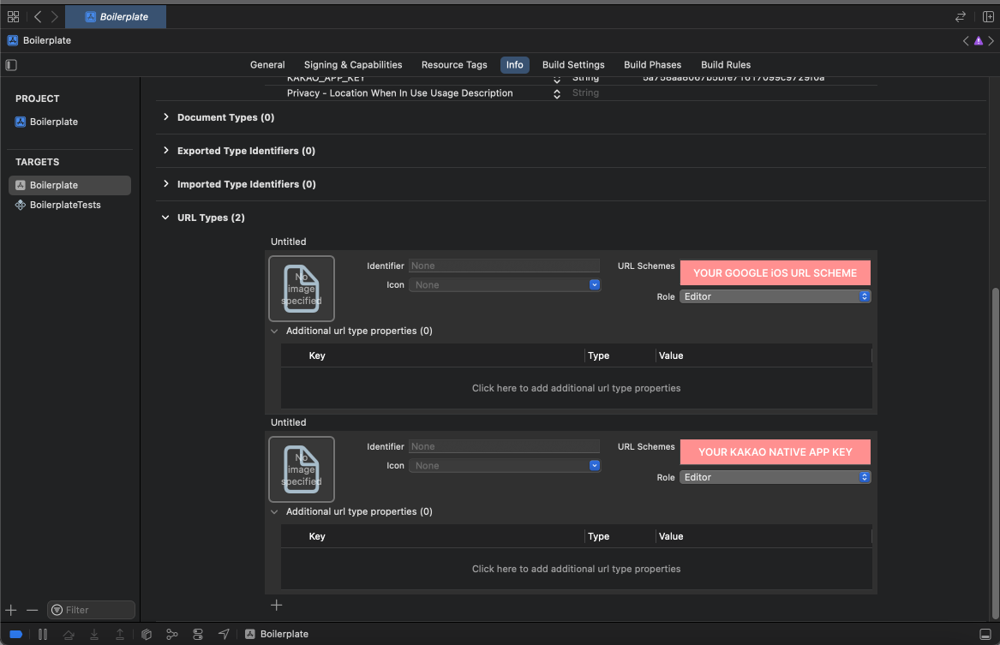

## Google Sign-in Guide

### 1. Google project configuration

- Add OAuth 2.0 Clients from [Google Cloud](https://console.cloud.google.com/apis/credentials)
- Follow the instructions to [Configure a Google API Project](https://developers.google.com/identity/authentication) from the official docs.

### 2. Native settings

- Android
  - Update `android/app/src/main/res/values/strings.xml`
  ```xml
  <string name="server_client_id">YOUR_WEB_CLIENT_ID</string>
  ```
- iOS (Xcode configuration)
  - Configure URL types (see screenshot)
    <div align="center">
        
    </div>

### 3. Project settings

- Update `src/config/index.ts`

  ```ts
  export default {
    WEB_CLIENT_ID: "YOUR_WEB_CLIENT_ID",
    IOS_CLIENT_ID: "YOUR_IOS_CLIENT_ID",
  };
  ```

### References

- [Google Identity Authentication Docs](https://developers.google.com/identity/authentication)
- [react-native-google-signin/google-signin](https://github.com/react-native-google-signin/google-signin)
