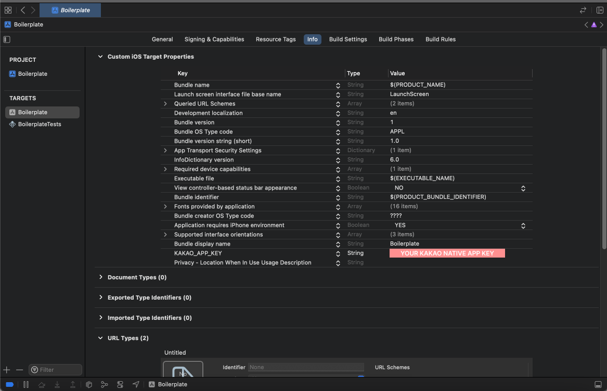
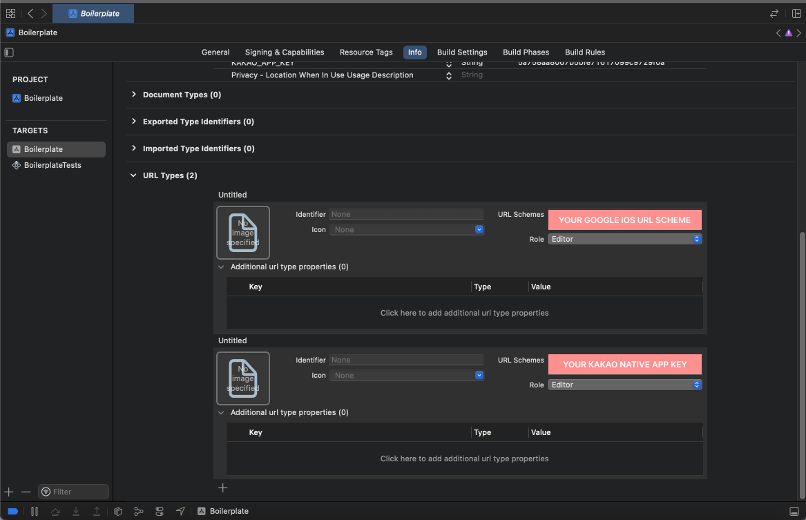

## Kakao Sign-in Guide

### 1. Kakao Developers configuration

- Add a new Application from [Kakao Developers](https://developers.kakao.com/)
- Activate Kakao Login
  - Go to [My Application] > [Kakao Login].
  - Set 'State' to 'ON' under Kakao Login Activation on the Kakao Login page.
- Platform settings
  - Go to [My Application] > Click **Platform** in the left navigation menu
  - Update Andoroid / iOS platform information
    - Android
      - Package name: `android/app/main/AndroidManifest.xml` → package attribute from manifest tag
      - Key hash: `$ keytool -exportcert -alias androiddebugkey -keystore ~/.android/debug.keystore -storepass android -keypass android | openssl sha1 -binary | openssl base64`
    - iOS
      - Bundle ID: `Xcode > TARGETS > Project > Info > Packaging > Product Bundle Identifier`

### 2. Add Native app key to your project

- Android
  - Update `android/app/main/AndroidManifest.xml`
  ```xml
  <activity android:name="com.kakao.sdk.auth.AuthCodeHandlerActivity"
    android:exported="true">
    <intent-filter>
      <action android:name="android.intent.action.VIEW" />
      <category android:name="android.intent.category.DEFAULT" />
      <category android:name="android.intent.category.BROWSABLE" />
      <data android:host="oauth"
          android:scheme="kakao{YOUR_KAKAO_NATIVE_APP_KEY}" />
          <!-- put your native app key after 'kakao'  -->
    </intent-filter>
  </activity>
  ```
  - Update `android/app/src/main/res/values/strings.xml`
  ```xml
  <string name="kakao_app_key">YOUR_KAKAO_NATIVE_APP_KEY</string>
  ```
- iOS (Xcode configuration)
  - Go to [TARGETS] > [My Application] > [Info] > Add Kakao Native app key to Custom iOS Target Properties (see screenshot)
    <div align="center">
        
    </div>
  - Configure URL types (see screenshot)
    <div align="center">
        
    </div>

### References

- [Kakao Login Docs](https://developers.kakao.com/docs/latest/en/kakaologin/common)
- [@react-native-seoul/kakao-login](https://github.com/react-native-seoul/react-native-kakao-login)
- [stack overflow - There is no debug.keystore in .android folder](https://stackoverflow.com/questions/8576732/there-is-no-debug-keystore-in-android-folder)
